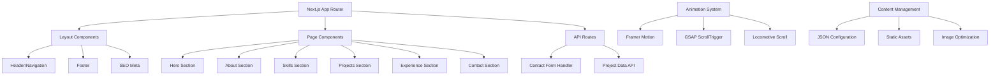

# Design Document

## Overview

The professional portfolio website will be built as a modern, single-page application using Next.js 15 with TypeScript, featuring smooth animations, responsive design, and optimal performance. The design emphasizes clean aesthetics, professional presentation, and exceptional user experience across all devices.

The architecture follows modern web development best practices with server-side rendering for SEO optimization, component-based architecture for maintainability, and progressive enhancement for accessibility. The design incorporates current trends including micro-interactions, smooth scrolling, glassmorphism effects, and mobile-first responsive design.

## Architecture

### Technology Stack

**Frontend Framework:**
- Next.js 15 with App Router for server-side rendering and static site generation
- React 18 with TypeScript for type safety and developer experience
- Tailwind CSS for utility-first styling and rapid development

**Animation Libraries:**
- Framer Motion for React-specific animations and page transitions
- GSAP (GreenSock) for complex scroll-triggered animations and timeline sequences
- Locomotive Scroll for smooth scrolling effects

**Performance & SEO:**
- Next.js built-in image optimization
- Critical CSS inlining for above-the-fold content
- Automatic code splitting and lazy loading
- Structured data markup for search engines

**Development Tools:**
- ESLint and Prettier for code quality
- Husky for pre-commit hooks
- Lighthouse CI for performance monitoring

### System Architecture



## Components and Interfaces

### Core Layout Components

**AppLayout Component:**
```typescript
interface AppLayoutProps {
  children: React.ReactNode;
  metadata: SEOMetadata;
}

interface SEOMetadata {
  title: string;
  description: string;
  keywords: string[];
  ogImage: string;
  canonicalUrl: string;
}
```

**Navigation Component:**
```typescript
interface NavigationProps {
  sections: NavigationSection[];
  currentSection: string;
  isMobile: boolean;
}

interface NavigationSection {
  id: string;
  label: string;
  href: string;
  order: number;
}
```

### Section Components

**Hero Section:**
```typescript
interface HeroSectionProps {
  profile: ProfileData;
  animations: HeroAnimations;
}

interface ProfileData {
  name: string;
  title: string;
  subtitle: string;
  description: string;
  avatar: ImageData;
  socialLinks: SocialLink[];
  ctaButton: CTAButton;
}

interface HeroAnimations {
  textReveal: AnimationConfig;
  avatarHover: AnimationConfig;
  backgroundParticles: ParticleConfig;
}
```

**Projects Showcase:**
```typescript
interface ProjectsShowcaseProps {
  projects: Project[];
  categories: ProjectCategory[];
  layout: 'grid' | 'masonry' | 'carousel';
}

interface Project {
  id: string;
  title: string;
  description: string;
  technologies: Technology[];
  category: string;
  images: ImageData[];
  liveUrl?: string;
  githubUrl?: string;
  featured: boolean;
  completedDate: Date;
}

interface ProjectCategory {
  id: string;
  name: string;
  color: string;
  icon: string;
}
```

**Skills Visualization:**
```typescript
interface SkillsVisualizationProps {
  skillGroups: SkillGroup[];
  visualizationType: 'bars' | 'circles' | 'hexagon' | 'cards';
}

interface SkillGroup {
  category: string;
  skills: Skill[];
  color: string;
  icon: string;
}

interface Skill {
  name: string;
  proficiency: number; // 0-100
  yearsExperience: number;
  projects: string[]; // Project IDs
  certifications?: string[];
}
```

**Contact Form:**
```typescript
interface ContactFormProps {
  onSubmit: (data: ContactFormData) => Promise<ContactFormResponse>;
  validation: ValidationRules;
}

interface ContactFormData {
  name: string;
  email: string;
  subject: string;
  message: string;
  honeypot?: string; // Anti-spam
}

interface ContactFormResponse {
  success: boolean;
  message: string;
  errors?: ValidationError[];
}
```

### Animation System Interfaces

**Animation Configuration:**
```typescript
interface AnimationConfig {
  type: 'fadeIn' | 'slideUp' | 'scaleIn' | 'rotateIn' | 'custom';
  duration: number;
  delay: number;
  easing: string;
  trigger?: ScrollTriggerConfig;
}

interface ScrollTriggerConfig {
  start: string;
  end: string;
  scrub: boolean;
  pin: boolean;
  markers?: boolean;
}

interface ParticleConfig {
  count: number;
  size: { min: number; max: number };
  speed: { min: number; max: number };
  colors: string[];
  shapes: 'circle' | 'square' | 'triangle'[];
}
```

## Data Models

### Content Configuration Model

```typescript
interface PortfolioConfig {
  personal: PersonalInfo;
  sections: SectionConfig[];
  theme: ThemeConfig;
  seo: SEOConfig;
  analytics: AnalyticsConfig;
}

interface PersonalInfo {
  name: string;
  title: string;
  email: string;
  phone?: string;
  location: string;
  bio: string;
  avatar: string;
  resume: string;
  socialLinks: SocialLink[];
}

interface SectionConfig {
  id: string;
  enabled: boolean;
  order: number;
  title: string;
  subtitle?: string;
  content: any; // Section-specific content
  animations: AnimationConfig[];
}

interface ThemeConfig {
  colorScheme: 'light' | 'dark' | 'auto';
  primaryColor: string;
  secondaryColor: string;
  accentColor: string;
  fontFamily: {
    heading: string;
    body: string;
    mono: string;
  };
  borderRadius: string;
  shadows: boolean;
  glassmorphism: boolean;
}
```

### Project Data Model

```typescript
interface ProjectData {
  projects: Project[];
  categories: ProjectCategory[];
  technologies: Technology[];
}

interface Technology {
  id: string;
  name: string;
  category: 'frontend' | 'backend' | 'database' | 'tool' | 'cloud';
  icon: string;
  color: string;
  proficiency: number;
}

interface ImageData {
  src: string;
  alt: string;
  width: number;
  height: number;
  placeholder?: string;
  priority?: boolean;
}
```

### Experience Data Model

```typescript
interface ExperienceData {
  workExperience: WorkExperience[];
  education: Education[];
  certifications: Certification[];
  achievements: Achievement[];
}

interface WorkExperience {
  id: string;
  company: string;
  position: string;
  startDate: Date;
  endDate?: Date;
  current: boolean;
  description: string;
  responsibilities: string[];
  technologies: string[];
  achievements: string[];
  companyLogo?: string;
  companyUrl?: string;
}

interface Education {
  id: string;
  institution: string;
  degree: string;
  field: string;
  startDate: Date;
  endDate: Date;
  gpa?: number;
  honors?: string[];
  relevantCourses?: string[];
}
```

## Correctness Properties

*A property is a characteristic or behavior that should hold true across all valid executions of a system—essentially, a formal statement about what the system should do. Properties serve as the bridge between human-readable specifications and machine-verifiable correctness guarantees.*

### Property 1: Hero Section Performance and Functionality
*For any* portfolio configuration, the hero section should load and display within 2 seconds, include a functional call-to-action button that navigates to the contact section, and display a professional avatar with hover animations.
**Validates: Requirements 1.1, 1.2, 1.4**

### Property 2: Project Showcase Filtering and Display
*For any* set of projects and filter categories, the project showcase should display all projects in a responsive grid, filter projects by category within 300ms, and show detailed project information including all required fields when clicked.
**Validates: Requirements 2.1, 2.2, 2.3**

### Property 3: Skills Visualization and Interaction
*For any* skills dataset, the skills visualization should display all skills with proficiency indicators, group them by categories, and provide interactive hover details for each skill.
**Validates: Requirements 3.1, 3.2, 3.4**

### Property 4: Animation System Consistency
*For any* page element with animations, the animation system should apply smooth transitions during state changes, trigger animations when elements enter the viewport, and maintain consistent animation timing and easing.
**Validates: Requirements 1.3, 2.5, 3.3**

### Property 5: Responsive Design Adaptation
*For any* screen size from 320px to 4K displays, the responsive design should adapt layouts seamlessly, transform navigation to hamburger menu on mobile, maintain touch-friendly targets of at least 44px, and handle orientation changes without content loss.
**Validates: Requirements 4.1, 4.2, 4.3, 4.4**

### Property 6: Navigation System Behavior
*For any* navigation interaction, the system should provide smooth scrolling between sections, highlight the current section based on scroll position, remain functional across all device sizes, provide keyboard focus indicators, and show back-to-top functionality after scrolling past the hero.
**Validates: Requirements 5.1, 5.2, 5.3, 5.4, 5.5**

### Property 7: Contact Form Validation and Submission
*For any* contact form input, the form should handle valid submissions with success confirmation, display specific validation errors for invalid inputs, include all required fields with proper validation, show loading states during submission, and maintain full accessibility.
**Validates: Requirements 6.1, 6.2, 6.3, 6.4, 6.5**

### Property 8: Performance Optimization Compliance
*For any* production deployment, the portfolio system should achieve Lighthouse performance score of 90+, implement image optimization and lazy loading, inline critical CSS, prioritize script loading, and compress all assets.
**Validates: Requirements 7.1, 7.2, 7.3, 7.4, 7.5**

### Property 9: SEO and Semantic Structure
*For any* page content, the system should include proper meta tags and structured data, generate a sitemap, use semantic HTML elements, provide descriptive alt text for all images, and implement proper heading hierarchy.
**Validates: Requirements 8.1, 8.2, 8.3, 8.4, 8.5**

### Property 10: Cross-Browser and Accessibility Compliance
*For any* browser environment (Chrome, Firefox, Safari, Edge), the system should function correctly, meet WCAG 2.1 AA standards, provide appropriate ARIA labels, support keyboard-only navigation, and maintain proper color contrast ratios.
**Validates: Requirements 9.1, 9.2, 9.3, 9.4, 9.5**

### Property 11: Content Management Flexibility
*For any* content update operation, the system should separate content from code through configuration, reflect changes without code modifications, support customizable themes, allow easy addition/removal of content entries, and include comprehensive documentation.
**Validates: Requirements 10.1, 10.2, 10.3, 10.4, 10.5**

### Property 12: Mobile Performance Optimization
*For any* mobile device on 3G connections, the portfolio system should load and render correctly within 3 seconds while maintaining all functionality.
**Validates: Requirements 4.5**

## Error Handling

### Client-Side Error Handling

**Form Validation Errors:**
- Real-time validation with immediate feedback
- Field-specific error messages with clear instructions
- Graceful handling of network failures during form submission
- Retry mechanisms for failed submissions

**Image Loading Errors:**
- Fallback images for failed loads
- Progressive image enhancement
- Graceful degradation for unsupported formats
- Loading state indicators

**Animation Errors:**
- Fallback to CSS transitions if JavaScript animations fail
- Reduced motion support for accessibility preferences
- Performance monitoring to disable animations on low-end devices

### Network and Performance Error Handling

**Slow Network Conditions:**
- Progressive loading with skeleton screens
- Critical content prioritization
- Offline-first approach with service workers
- Graceful degradation of non-essential features

**JavaScript Errors:**
- Error boundaries to prevent complete application crashes
- Fallback UI components for failed interactive elements
- Error reporting and monitoring
- Progressive enhancement approach

### Browser Compatibility Errors

**Feature Detection:**
- Polyfills for unsupported features
- Graceful fallbacks for modern CSS features
- Progressive enhancement for JavaScript functionality
- Clear messaging for unsupported browsers

## Testing Strategy

### Dual Testing Approach

The testing strategy employs both unit testing and property-based testing to ensure comprehensive coverage:

**Unit Tests:**
- Focus on specific examples, edge cases, and error conditions
- Test individual component functionality and integration points
- Validate specific user interactions and state changes
- Cover error handling and boundary conditions

**Property-Based Tests:**
- Verify universal properties across all inputs using generated test data
- Test system behavior with randomized content configurations
- Validate responsive design across random screen sizes
- Ensure performance characteristics hold across various conditions

### Property-Based Testing Configuration

**Testing Framework:** Jest with fast-check library for property-based testing
**Test Configuration:**
- Minimum 100 iterations per property test
- Each property test references its design document property
- Tag format: **Feature: professional-portfolio, Property {number}: {property_text}**

**Test Categories:**

1. **Component Rendering Tests:**
   - Generate random portfolio configurations
   - Test component rendering with various data sets
   - Validate responsive behavior across screen sizes

2. **Animation and Interaction Tests:**
   - Test animation triggers with various scroll positions
   - Validate hover states and transitions
   - Ensure animation performance across devices

3. **Performance Tests:**
   - Validate load times with different content volumes
   - Test image optimization across various image types
   - Measure bundle sizes and loading performance

4. **Accessibility Tests:**
   - Automated accessibility auditing with axe-core
   - Keyboard navigation testing
   - Screen reader compatibility testing
   - Color contrast validation

5. **Cross-Browser Tests:**
   - Automated testing across browser matrix
   - Feature detection and fallback testing
   - Visual regression testing

### Testing Implementation

**Unit Testing:**
- Component-level tests for individual sections
- Integration tests for navigation and form functionality
- Snapshot tests for consistent UI rendering
- Mock external dependencies and API calls

**Property-Based Testing:**
- Each correctness property implemented as a single property-based test
- Random data generation for portfolio content
- Responsive design testing across generated screen sizes
- Performance property validation with synthetic data

**End-to-End Testing:**
- Critical user journey testing
- Cross-browser compatibility validation
- Performance monitoring in production-like environments
- Accessibility compliance verification
